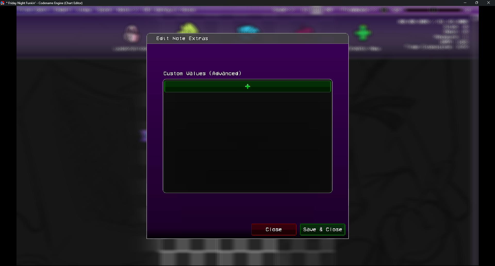
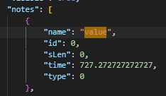

## Note Extra Chart Editor
Currently figuring out how Chart Editor works in Codename Engine, so soon this addon will be deprecated.

### Features
- Allows editing the `extra` variable for a Note in the Chart Editor.

Thats all this adds.

I used it to allow my Custom Note Types to have different effects, when I wanted to.
You could edit the chart manually to add this, but this makes it easier.

## Showcase

Checkout the [Example.hx](./songs/Example.hx.disabled) to see how to use it.

## Why it works?
Codename Engine Actually already does most of the work, I just made a friendly UI for it.
inside your Chart, if your note has any data inside of it, it automatically goes into the `extra` variable.

